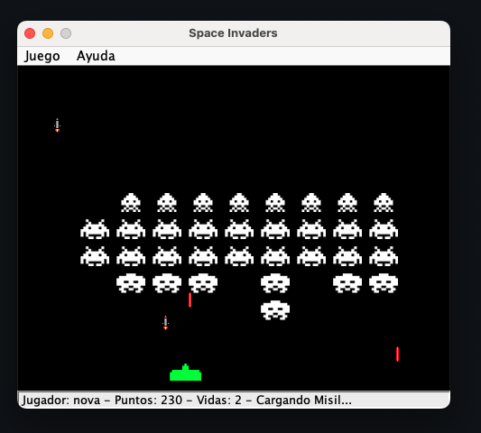

# space-invaders

Space Invaders clone built using Java and multiple Software Design Patterns.
Examples of Software Design Patterns are usually shown in isolation from
each other so this project aims to show how they would interact in the
context of a bigger application.

## Software Design Patterns

| Pattern | Functionality | Status |
| ------- | ------------- | ------ |
| [Null Object](https://en.wikipedia.org/wiki/Null_object_pattern) | 👤 Player | ✅ |
| [Memento](https://en.wikipedia.org/wiki/Memento_pattern) | 👤 Player | ✅ |
| [Proxy](https://en.wikipedia.org/wiki/Proxy_pattern) | 👤 Player | ✅ |
| [Prototype](https://en.wikipedia.org/wiki/Prototype_pattern) | 🔫 Bullets | ✅ |
| [Factory Method](https://en.wikipedia.org/wiki/Factory_method_pattern) | 👾 Enemies | ✅ |
| [Facade](https://en.wikipedia.org/wiki/Facade_pattern) | ⚙️ Model | ✅ |
| [Singleton](https://en.wikipedia.org/wiki/Singleton_pattern) | 🚀 Player Ship | ✅ |
| [Flyweight](https://en.wikipedia.org/wiki/Flyweight_pattern) | 🧚‍♀️ Sprites | ✅ |
| [Command](https://en.wikipedia.org/wiki/Command_pattern) | ⌨️ Keyboard Input | ✅ |
| [Observer](https://en.wikipedia.org/wiki/Observer_pattern) | 🎮 Adaptive Difficulty | ⛔️ |
| [Strategy](https://en.wikipedia.org/wiki/Strategy_pattern) | 🎮 Adaptive Difficulty | ⛔️ |
| [Interpreter](https://en.wikipedia.org/wiki/Interpreter_pattern) | 👾 Enemy Movement | ⛔️ |
| [Visitor](https://en.wikipedia.org/wiki/Visitor_pattern) | 👾 Enemy Movement | ⛔️ |
| [State](https://en.wikipedia.org/wiki/State_pattern) | ⏸ Pause | ⛔️ |


## Screenshot


## Commands

To perform the code style check run:

```
mvn checkstyle:check
```

To run the tests and compile the project run:

```
mvn package
```

To run the game after the compilation is finished run:

```
java -cp target/space-invaders-1.0-SNAPSHOT.jar edu.patterns.gui.Game
```

To generate the documentation run:

```
mvn javadoc:javadoc
```
